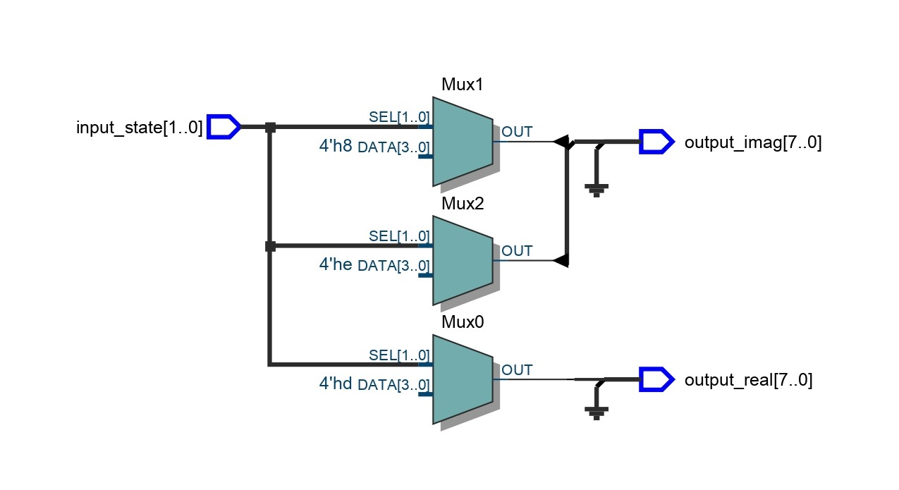

## Overview
The **Quantum State Encoder** is a VHDL-based hardware design aimed at encoding quantum states into binary representations. This project focuses on implementing fundamental quantum gates and encoding quantum states suitable for FPGA-based quantum computing simulations.

## Features
- Encodes quantum states $\vert 0 \rangle$, $\vert 1 \rangle$, $\vert + \rangle$, $\vert - \rangle$ into binary values split into real and imaginary parts.
- Designed in VHDL for hardware implementation and extensibility.
- Provides a framework for simulating quantum gates and state encoding on FPGA.
