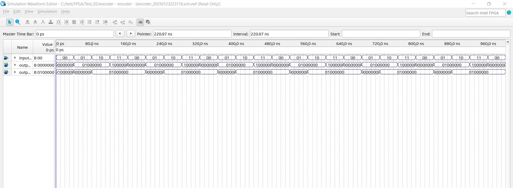

## Overview
The **Quantum State Encoder** is a VHDL-based hardware design aimed at encoding quantum states into binary representations. This project focuses on implementing fundamental quantum gates and encoding quantum states suitable for FPGA-based quantum computing simulations.

## Features
- Encodes quantum states $\vert 0 \rangle$, $\vert 1 \rangle$, $\vert + \rangle$, $\vert - \rangle$ into binary values split into real and imaginary parts.
- Designed in VHDL for hardware implementation and extensibility.
- Provides a framework for simulating quantum gates and state encoding on FPGA.

## Quantum States Encoding
The encoder maps quantum states into binary values as follows:

$$
\begin{aligned}
\text{STATE $\vert 0 \rangle$:} & \quad \vert 0 \rangle \rightarrow \text{Real} = 64, \; \text{Imaginary} = 0 \\
\text{STATE $\vert 1 \rangle$:} & \quad \vert 1 \rangle \rightarrow \text{Real} = 0, \; \text{Imaginary} = 64 \\
\text{STATE $\vert + \rangle$:} & \quad \vert + \rangle \rightarrow \text{Real} = 64, \; \text{Imaginary} = 64 \\
\text{STATE $\vert - \rangle$:} & \quad \vert - \rangle \rightarrow \text{Real} = 64, \; \text{Imaginary} = -64
\end{aligned}
$$

## VHDL Design Structure
### Entity Declaration
The encoder uses the following I/O ports:

- **`input_state`**: 2-bit selector for quantum state input.
- **`output_real`**: 8-bit real part of the encoded state.
- **`output_imag`**: 8-bit imaginary part of the encoded state.

### Architecture
The encoder implements a case-based selection for quantum state encoding:

- **Input States:**
  - `"00"`: $\vert 0 \rangle$
  - `"01"`: $\vert 1 \rangle$
  - `"10"`: $\vert + \rangle$
  - `"11"`: $\vert - \rangle$
- **Default Output**: Real and imaginary parts are set to zero for undefined states.

### Constants
Each quantum state is encoded as a 16-bit binary constant, split into real and imaginary parts:

$$
\text{STATE$ \vert 1 \rangle$} = 0x4000, \ \\
\text{STATE$ \vert 0 \rangle$} = 0x0040, \ \\
\text{STATE$ \vert + \rangle$} = 0x4040, \  \\
\text{STATE$ \vert - \rangle$} = 0x40C0 \;
$$

## Simulation
The simulation verifies the encoder's functionality using the following tools:
- **Toolchain**: Compatible with ModelSim.
- **Testbench**: Validates all quantum states and ensures correct binary output.
- **Waveform Analysis**: Visualizes real and imaginary parts for verification.

## Applications
- Hardware emulation of quantum algorithms.
- Prototyping quantum gates on FPGA hardware.
- Extension for multi-qubit state encoding.

## Future Enhancements
- Support for additional quantum gates like $R_x$, $R_y$, $R_z$.
- Optimization for FPGA resource usage.
- Implementation of multi-qubit state encoders.

